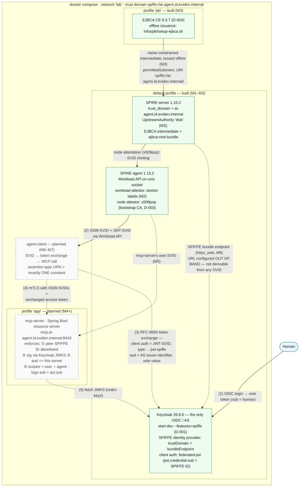
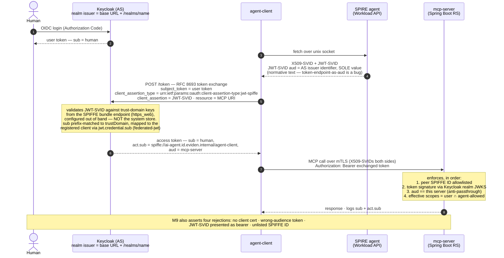
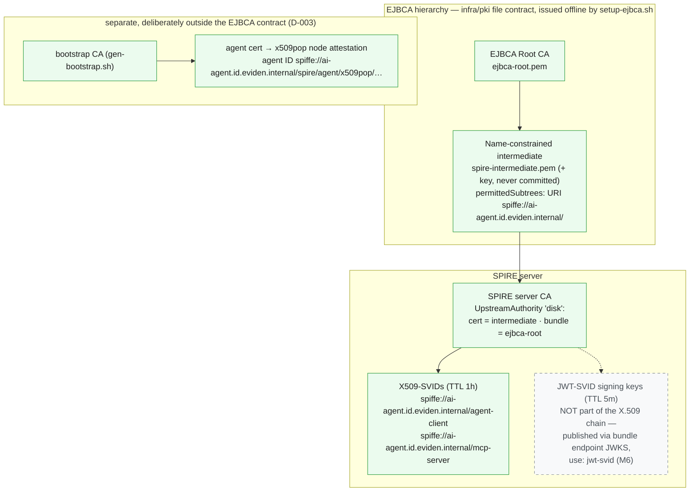
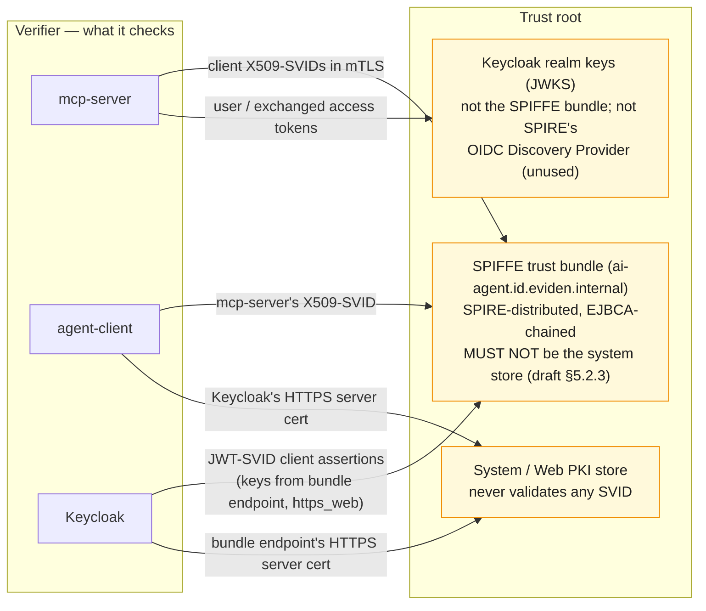

# Diagrams — end-to-end system

Rendered views of what this lab builds. Source of truth stays in [ARCHITECTURE.md](../ARCHITECTURE.md), [BUILD-PLAN.md](../BUILD-PLAN.md), and [DECISIONS.md](../DECISIONS.md) — if a diagram and a doc disagree, the doc wins and the diagram gets fixed.

An editable canvas version lives in [architecture.excalidraw](architecture.excalidraw).

**Status legend** (as of branch `m3-ejbca`): green/solid = built · gray/dashed = planned.

| Milestone | Status |
|---|---|
| M0 Keycloak SPIFFE support spike | ✅ done — D-001: supported in 26.6.0 via `--features=spiffe` |
| M1 Skeleton up | ✅ done |
| M2 SPIRE issues SVIDs (docker label selectors) | ✅ done |
| M3 EJBCA upstream CA (`disk` UpstreamAuthority) | 🔄 in progress on this branch — exit check: `scripts/check-m3.sh` |
| M4 MCP resource server · M5 SVID mTLS · M6 jwt-spiffe client auth · M7 token exchange w/ `act` · M8 cert-bound tokens · M9 acceptance | ⏳ planned |

---

## 1. Component topology

> The one rule: SPIFFE answers **which workload**, OIDC answers **on behalf of which human**. The only bridge is RFC 8693 token exchange. SPIRE's OIDC Discovery Provider is **not** used — the only OIDC here is Keycloak.

## 2. End-to-end token flow (the happy path M9 asserts)

## 3. PKI chain of custody (M3)

M3's exit check (`scripts/check-m3.sh`) verifies a fresh SVID chains to `ejbca-root.pem` **and** runs the negative test: a leaf with URI SAN outside `spiffe://ai-agent.id.eviden.internal/` must be rejected. Whether *each* verifier in the stack (openssl, JDK, …) enforces the URI name constraint is tracked in D-002 — until proven per verifier, the constraint is governance value, not a technical control.

## 4. The three trust stores

Three unrelated validation roots coexist; every TLS/JWT bug in this lab starts with confusing two of them (full table in [ARCHITECTURE.md](../ARCHITECTURE.md)).

